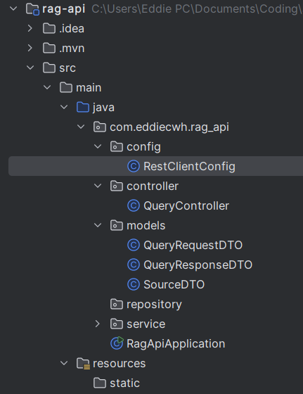
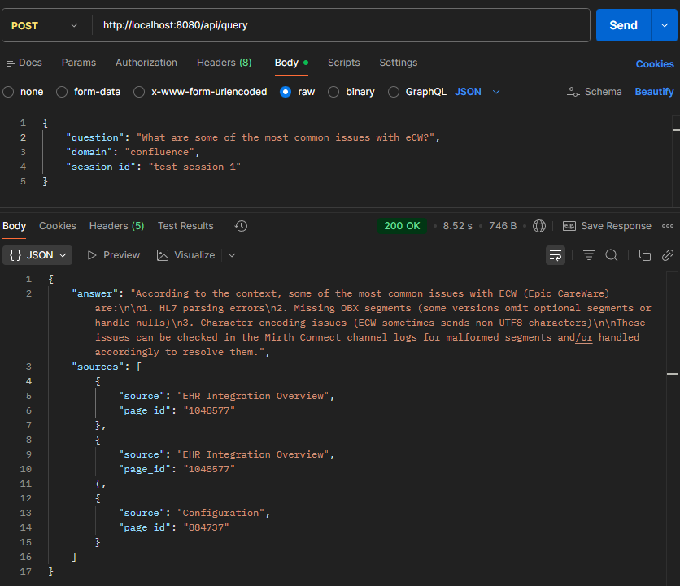
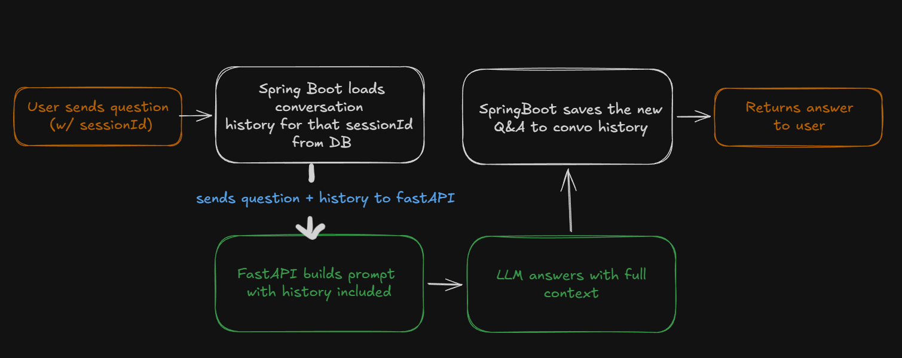
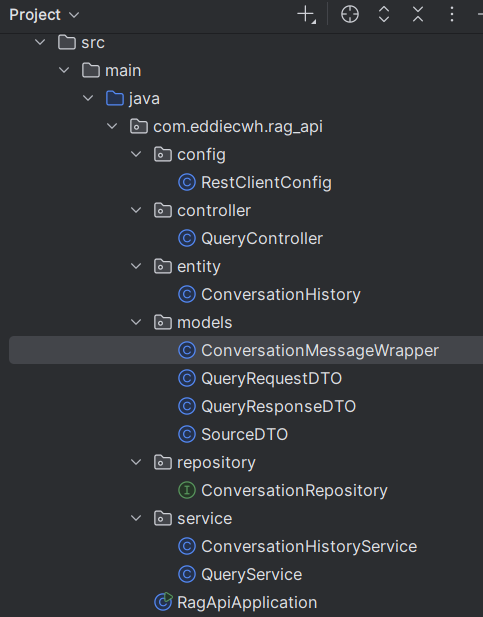
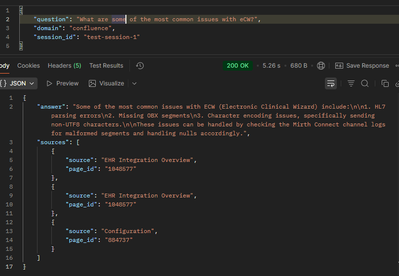
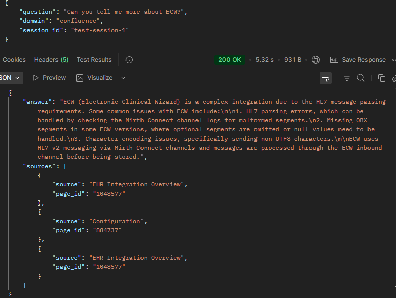
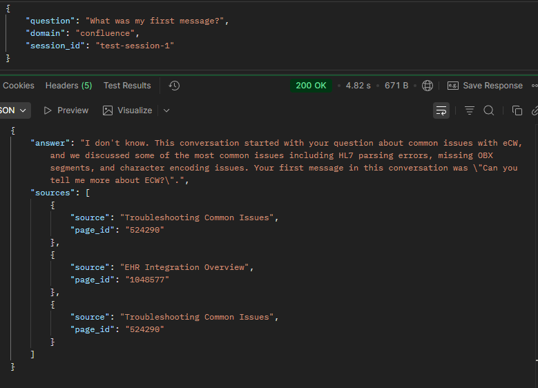
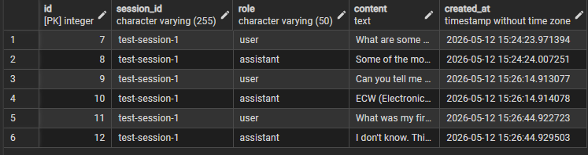

Starting today with building out the Spring Boot API layer for our RAG AI chatbot. Our end goal involves us integrating our Spring Boot endpoints into a Slack application:

When Slack sends a /ask request, our endpoint needs to do a few things:

1. Return a `200 OK` response status to Slack within 3 seconds
2. In the background, process our RAG query (5 - 15s)
3. Post the answer back to Slack via `response_url`

This is important to consider when deciding between the two dependencies Spring Web and Spring Reactive Web. I have not worked with Spring Reactive web before but Claude outlines a few differences between both:

| Spring Web | Spring Reactive Web |
| --- | --- |
| Built on top of the traditional Servlet API | Built on Project Reactor |
| Synchronous and blocking — when a request comes in, a thread is assigned to it and blocks until the response is ready | Non-blocking and async — a small number of threads can handle thousands of concurrent requests |
| Uses RestTemplate for outbound HTTP calls | Uses WebClient for outbound HTTP calls |
| What most Spring Boot apps use by default | Better for high concurrency and I/O heavy workloads |
| Simpler to reason about | Steeper learning curve |

With Spring Web, step 1 and step 2 would happen on the same thread, so the response can't go out until the RAG query finishes.
With Reactive WebFlux, step 1 returns immediately and step 2 runs asysncrhonously, but we can get around this with `@Async` and `thread pools`, so I'm going to go with route 1 for the learning experience



<p style="text-align: center; font-style: italic">Base SpringBoot project dir buildout</p>



Testing our 1 endpoint:

Sprint Boot (/api/query) -> FastAPI (/api/query) -> response

We are able to get a succesful response. Seems silly now, 2 endpoints that are doing the same thing, but it'll make more sense when we incorporate the use of the session values so we can implement conversational RAG and our application be more than a 1 question 1 answer chatbot.

#### Building Out Conversational Rag

With our current setup, our requests to our FastAPI endpoints are stateless

1. We ask our question
2. Our LLM reads our query and supplied context
3. Then returns a response

* conversation ends *

With Conversational RAG, the key idea is to pass the conversation history as part our prompt

So instead of:

```
Question: what is ehr_timeout_seconds?
Answer: It's 30 seconds in staging

Question: What about in production?
Answer: I don't know

second question is stateless and passes no context from previous requests
```

So with conversational rag:
```
Previous conversation:
Question: what is ehr_timeout_seconds?
Answer: It's 30 seconds in staging

Current Question:
Question: What about in production?
Answer: It's 15 seconds in production

second question is stateful and passes conversation history from previous requests
```



Our Python service will continue to remain stateless. Spring Boot will manage the state, each request will just
include the history.

What we will need:

- A `ConversationHistory` `JPA entity` — stores messages per session
- A `ConversationRepository` — reads/writes history
- Update `QueryService` — load history, send with request, save response
- Update `FastAPI QueryRequest` — accept conversation history

Let's think through our schema, for our table `conversation_history`

```
id            SERIAL PRIMARY KEY
session_id    VARCHAR(255)    -- groups messages into one conversation
role          VARCHAR(50)     -- "user" or "llm"
content       TEXT            -- the actual message text
created_at    TIMESTAMP       -- when it was sent
```

Each row in the table will contain one message from either side

| id | session_id | role | content | created_at |
| --- | --- | --- | --- | --- | --- |
| 1 | session-abc | user | what is ehr_timeout_seconds? | 2026-05-01 | 10:00 | 
| 2 | session-abc | llm | It's 30 seconds in staging | 2026-05-01 | 10:00 |
| 3 | session-abc | user | what about in production? | 2026-05-01 | 10:01 | 
| 4 | session-abc | llm | It's 60 seconds in production | 2026-05-01 | 10:01 |

We could have session_id be a foreign key that belongs to its own table, but to keep things simple I think we'll design this in mind that the value will be auto generated everytime a new chat is started

Our new requestBody that is passed through each API call (via SpringBoot) should now also incorporate our new history field (all previous messages belonging to the same sessionId)

```
{
  "question": "what is ehr_timeout_seconds?",
  "domain": "confluence",
  "sessionId": "abc-123",
  "history": [
    {"role": "user", "content": "what is appointment_sync_enabled?"},
    {"role": "assistant", "content": "It controls whether sync jobs run..."}
  ]
}
```



<p style="text-align: center; font-style: italic">Updated project structure</p>

I am now also realizing that I did not updated the `build_prompt` method in our Python script so our context isn't actually being used...

<div style="text-align: center">
  
</div>

Creating and mofiying our wrapper classes and requestBodies to mimic our Java DTOs setup

```
class ConversationalMessage(BaseModel):
  role: str
  content: str

class QueryRequest(BaseModel):
  question: str
  domain: str = None
  session_id: str = None
  history: Optional[List[ConversationalMessage]] = None
```

### Testing our Conversational RAG ChatBot





Looks good, we're able to have more than a one question conversation! Although, I'll have to make some changes to the domain field as it requires a domain to be given (confluence, slack, etc..) or it will fail, and it is currently setup as a string so if it is not a direct match with what's in the database it will fail.


